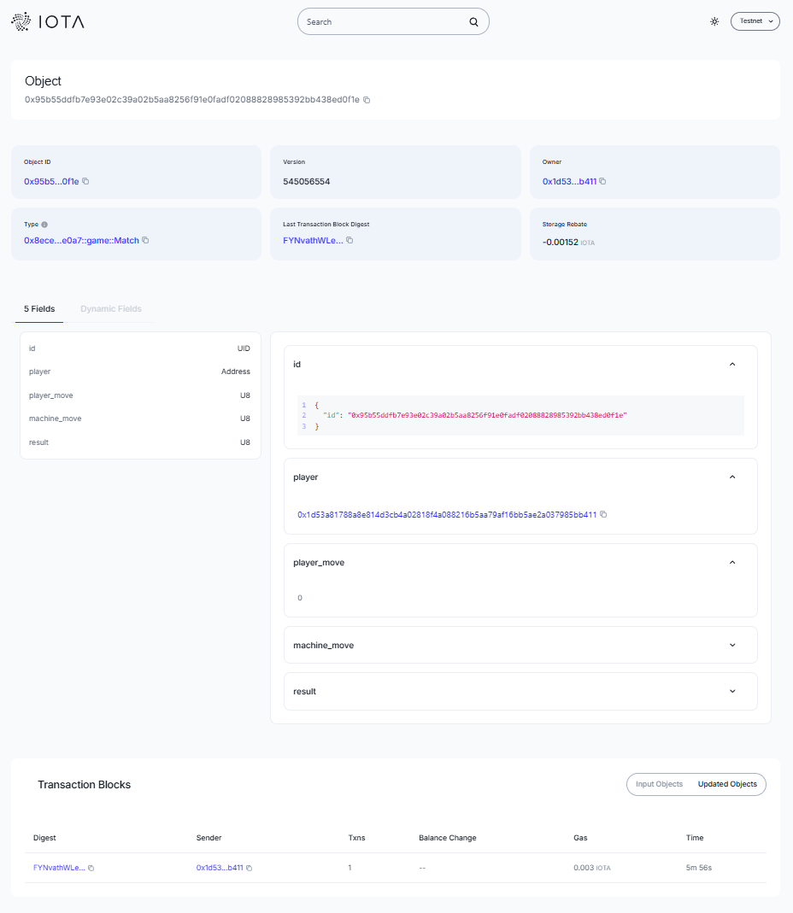

# Rock · Paper · Scissors (IOTA Move)

Play Rock–Paper–Scissors against an on-chain machine. The Move contract mints a `Match` object storing both moves and the outcome; the Next.js app reads it back on IOTA testnet.

## Contract Address

- Network: Testnet  
- Package ID: `0x8ecea280b288106dd7d7d9cbafe3f9f97a2fffb497fa7ce7785d4f10aeace0a7`  
- Explorer: https://explorer.testnet.iota.org/object/0x8ecea280b288106dd7d7d9cbafe3f9f97a2fffb497fa7ce7785d4f10aeace0a7

## Quick Start

```bash
npm install --legacy-peer-deps
npm run dev
```

Then open http://localhost:3000 and connect your wallet on **testnet**.

## Deploying the Move Package (manual)

```bash
cd contract/rock_paper_scissor
iota move build
iota client publish --gas-budget 100000000 --json  # package ID printed in output
```

If you redeploy, update `lib/config.ts` with the new testnet package ID.

## Project Structure

- `contract/rock_paper_scissor`: Move package with `game::play` entry
- `components/sample.tsx`: Rock–Paper–Scissors UI
- `hooks/useContract.ts`: Contract calls and object parsing
- `lib/config.ts`: Network configuration (default testnet)

## Gameplay Notes

- Moves: 0 = Rock, 1 = Paper, 2 = Scissors  
- Machine move: derived from the minted object ID for replayable results  
- Each play stores the match object ID in the URL hash for easy sharing

## Contract Address
- https://explorer.iota.org/object/0x95b55ddfb7e93e02c39a02b5aa8256f91e0fadf02088828985392bb438ed0f1e?network=testnet
"# IOTA-rock-paper-scissor" 
